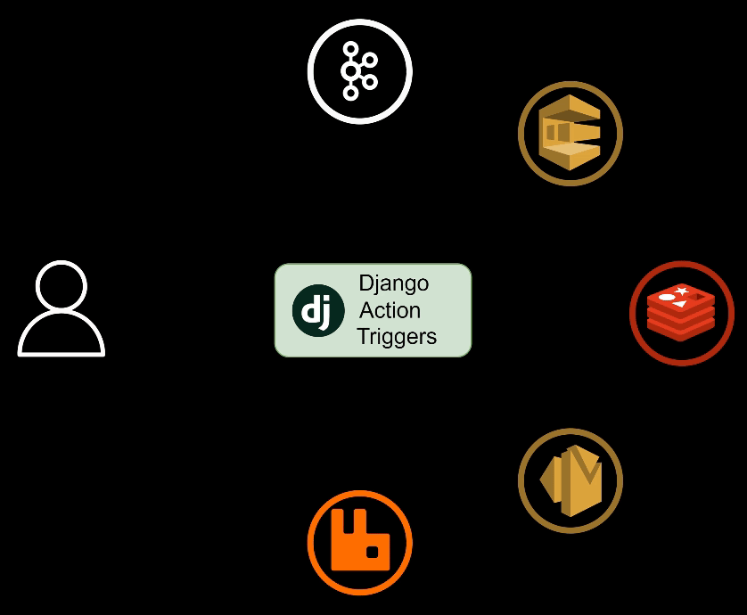

# Django Action Triggers

 [](https://badge.fury.io/py/django-action-triggers) [](https://codecov.io/github/Salaah01/django-action-triggers)  


## Table of Contents
- [Django Action Triggers](#django-action-triggers)
  - [Table of Contents](#table-of-contents)
  - [Description](#description)
  - [Why Use Django Action Triggers Over Django Signals?](#why-use-django-action-triggers-over-django-signals)
    - [How Django Action Triggers Helps](#how-django-action-triggers-helps)
    - [Built-in Integrations](#built-in-integrations)
    - [Key Benefits:](#key-benefits)
  - [Key Features](#key-features)
  - [Documentation](#documentation)
  - [Supported Message Brokers](#supported-message-brokers)
  - [Supported Actions](#supported-actions)
  - [Installation](#installation)
  - [Usage](#usage)
  - [Example Scenarios](#example-scenarios)
    - [Example 1: Webhook Trigger on User Creation/Update/Deletion](#example-1-webhook-trigger-on-user-creationupdatedeletion)
    - [Example 2: Webhooks and Message Queues on Product and Sale Creation/Update](#example-2-webhooks-and-message-queues-on-product-and-sale-creationupdate)
  - [Don't See What You're Looking For?](#dont-see-what-youre-looking-for)
  - [License](#license)


## Description



In Django, signals are a powerful tool for responding to changes in your models or other parts of the application. Typically, you define signals in a signals.py file, specifying actions to take when certain events occur, like saving or deleting an object. While this approach works well in many cases, it can have some limitations:

This application is highly flexible and can be configured via code or through the Django admin interface.

## Why Use Django Action Triggers Over Django Signals?

In Django, signals are typically hardcoded in a `signals.py` file, where you define logic like "if this happens, do that." While this works well for many cases, it introduces a few limitations:

- **Changes require code updates:** Adding or modifying signals requires changes to your codebase and redeployment.
- **Static and inflexible:** Anytime you need to modify, add, or remove signals, you have to manually edit the code and redeploy the application.
- **Maintenance overhead:** As your application grows, managing signals this way can make the code harder to maintain and scale.

### How Django Action Triggers Helps

Django Action Triggers builds on Django’s signals by offering more flexibility at runtime. It allows you to create, modify, or remove signals and actions dynamically—**without needing to change your code**. This can all be done through the **UI or API**, making it easier to manage triggers and actions as your application evolves.

With Django Action Triggers, you can:

- **Manage signals dynamically** without redeployment, using the admin interface or API.
- **Adjust workflows at runtime** to respond to new requirements or integrations.
- **Reduce the need for manual code changes** when setting up new signals or actions.

### Built-in Integrations

Django Action Triggers also includes **out-of-the-box support** for popular services such as **AWS SNS**, **RabbitMQ**, **Kafka**, and more. This allows you to easily send messages to these services, streamlining integrations without needing custom code.

### Key Benefits:

- **No code changes or redeploys needed:** Manage signals and actions entirely through the UI or API.
- **Flexibility at runtime:** Easily add, modify, or remove actions and triggers on the fly.
- **Built-in integrations:** Connect seamlessly with external services like AWS SNS, Kafka, Redis, and more, saving time on implementation.

In summary, Django Action Triggers provides a **dynamic**, **maintainable** and **scalable** way to manage actions triggered by signals. It reduces the need for constant code changes while offering simple integration with popular external services.

## Key Features

- **Database-Driven Triggers**: Automatically trigger actions based on model events (e.g., save, delete).
- **Webhook Integration**: Send HTTP requests to external services when triggers are activated.
- **Message Broker Integration**: Send messages to messaging brokers like Kafka and RabbitMQ.
- **Actions Integration**: Trigger actions like AWS Lambda functions based on model events.
- **Extensible**: Easily extend to support custom triggers and actions.
- **Secure Dynamic Configuration**: Dynamically set values at runtime for secure and flexible configuration.

## Documentation

For detailed documentation, including setup, configuration options, API specifications, and more examples, please refer to the [official documentation](https://django-action-triggers.readthedocs.io/en/latest/).

## Supported Message Brokers

* Kafka
* RabbitMQ
* Redis
* AWS SQS (Amazon Simple Queue Service)
* AWS SNS (Amazon Simple Notification Service)
* GCP Pub/Sub (Google Cloud Pub/Sub)

## Supported Actions

* AWS Lambda

Need support for another message broker or action? Please submit a feature request on the [GitHub repository](https://github.com/Salaah01/django-action-triggers/issues).

## Installation

To install the package, run the following command:

```bash
pip install django-action-triggers
```

This command above will only install the base library, in order to support
specific integrations, you can install the following extras:

| Integration | Installation Command                           |
| ----------- | ---------------------------------------------- |
| RabbitMQ    | `pip install django-action-triggers[rabbitmq]` |
| Kafka       | `pip install django-action-triggers[kafka]`    |
| Redis       | `pip install django-action-triggers[redis]`    |
| AWS SQS     | `pip install django-action-triggers[aws]`      |
| AWS SNS     | `pip install django-action-triggers[aws]`      |
| GCP Pub/Sub | `pip install django-action-triggers[gcp]`      |
| AWS Lambda  | `pip install django-action-triggers[aws]`      |
| Webhooks    | `pip install django-action-triggers[webhooks]` |

Then, add the following to your `INSTALLED_APPS` in your Django settings:

```python
INSTALLED_APPS = [
    ...
    'action_triggers',
    ...
]
```

If you plan on using the API, add the following to your `urls.py`:

```python
from django.urls import path, include

urlpatterns = [
    ...
    path('api/action-triggers/', include('action_triggers.urls')),
    ...
]
```

## Usage

Once installed, you can create triggers and actions using the Django admin interface or programmatically through the API.

For detailed usage instructions, configuration options, and examples, please refer to the [official documentation](https://django-action-triggers.readthedocs.io/en/latest/).

## Example Scenarios

### Example 1: Webhook Trigger on User Creation/Update/Deletion

Trigger a webhook whenever a `User` model is created, updated, or deleted:

```json
{
  "config_signals": [
    {"signal": "post_save"},
    {"signal": "post_delete"}
  ],
  "content_types": [
    {
      "app_label": "auth",
      "model_name": "User"
    }
  ],
  "webhooks": [
    {
      "url": "https://my-webhook.com",
      "http_method": "POST",
      "headers": {
        "Authorization": "Bearer {{ myapp.utils.get_token }}"
      },
      "timeout_secs": 22.5
    }
  ],
  "active": true
}

```

### Example 2: Webhooks and Message Queues on Product and Sale Creation/Update

Trigger multiple webhooks and add messages to queues when `Product` or `Sale` models are created or updated:

```json
{
  "config_signals": [
    {"signal": "post_save"}
  ],
  "content_types": [
    {
      "app_label": "myapp",
      "model_name": "Product"
    },
    {
      "app_label": "myapp",
      "model_name": "Sale"
    }
  ],
  "webhooks": [
    {
      "url": "https://my-webhook.com",
      "http_method": "POST",
      "headers": {
        "Authorization": "Bearer {{ myapp.utils.get_token }}"
      },
      "timeout_secs": 10.5
    },
    {
      "url": "https://my-other-webhook.com",
      "http_method": "POST",
      "headers": {
        "Authorization": "Bearer {{ myapp.utils.get_token }}"
      }
    }
  ],
  "msg_broker_queues": [
    {
      "name": "my-msg-broker-config",
      "parameters": {
        "product_id": "{{ myapp.utils.get_product_id }}"
      },
      "timeout_secs": 2.5
    },
    {
      "name": "my-other-msg-broker-config",
      "parameters": {
        "sale_id": "{{ myapp.utils.get_sale_id }}"
      }
    }
  ],
  "active": true
}
```

## Don't See What You're Looking For?

If you have any feature requests or issues, please submit them to the [GitHub repository](https://github.com/Salaah01/django-action-triggers/issues). This also helps us prioritise new features and bug fixes.

## License

This project is licensed under the MIT License - see [LICENSE](./LICENSE) file for details.

