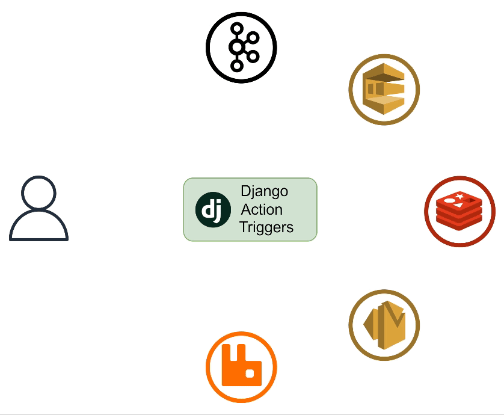

====================================
Django Action Triggers Documentation
====================================

.. role:: raw-html(raw)
    :format: html

.. image:: https://img.shields.io/badge/license-MIT-blue
   :alt: License MIT

.. image:: https://badge.fury.io/py/django-action-triggers.svg
   :target: https://badge.fury.io/py/django-action-triggers

.. image:: https://img.shields.io/pypi/pyversions/django-action-triggers
   :alt: PyPI - Supported Python Versions

.. image:: https://img.shields.io/badge/django-3.2%20%7C%204.2-blue
   :alt: Supported Django Versions

.. image:: https://codecov.io/github/Salaah01/django-action-triggers/graph/badge.svg?token=ROHNEE9D4X 
   :target: https://codecov.io/github/Salaah01/django-action-triggers

.. image:: https://img.shields.io/badge/Published%20on-Django%20Packages-0c3c26
   :target: https://djangopackages.org/packages/p/django-action-triggers/

Welcome to the documentation for
**Django Action Triggers (django-action-triggers)**, a flexible Django
application that allows you to asynchronously trigger actions based on changes
in the database.

Overview
========

:raw-html:` `
In **Django Action Triggers**, a **"trigger"** refers to an event that
initiates a corresponding **"action"**. Triggers are typically associated with
database changes, such as creating, updating, or deleting records,
while actions define the code that is executed in response to those changes.

Why Django Action Triggers Over Django Signals?
===============================================

In Django, signals are often hardcoded into a `signals.py` file to define
actions that happen when specific events occur (like saving or deleting a model
instance). While this is useful, it can have several limitations:

- **Changes require redeployments**: To add, remove, or update a signal, you
  must modify the code and redeploy your application.
- **Static configuration**: Signals are hardcoded, meaning there's little
  flexibility for runtime changes.
- **Maintenance burden**: As your application grows, managing multiple signals
  across different models can become cumbersome.
- **No out-of-the-box integrations**: Integrating signals with external
  services like **AWS**, **RabbitMQ**, **Kafka**, etc., requires additional
  custom code.

How Django Action Triggers Helps
--------------------------------

Django Action Triggers addresses these limitations by providing:

- **Dynamic signal management**: You can add, update, or remove signals without
  touching the codebase. Everything is managed through the
  **Django admin interface** or via the **API**, allowing for quick adjustments
  and runtime flexibility.
- **Built-in support for external services**: Seamless integration with popular
  message brokers such as **AWS SQS**, **Kafka**, **RabbitMQ**, and more,
  without the need for additional custom code.
- **Asynchronous actions**: Actions are handled asynchronously, ensuring that
  each trigger is processed efficiently without blocking the main thread.
- **Flexibility and scalability**: As your application grows, Django Action
  Triggers simplifies signal management, allowing you to easily scale and
  integrate with third-party services.

In short, Django Action Triggers allows you to manage and extend signal-driven
workflows at runtime, while also providing built-in integrations with external
services. It removes the need for code modifications and redeployments,
offering a more flexible and maintainable approach.

Supported Actions
-----------------

- **Webhooks**: Send HTTP requests to specified URLs when triggers are activated.
- **Message Brokers**: Send messages to messaging brokers like Kafka and RabbitMQ.
- **Actions**: Execute other actions such as invoking an AWS Lambda function.

Key Features
============

- **Database-Driven Triggers**: Automatically trigger actions based on specific database changes, such as model save events.
- **Flexible Action Handling**: Integrate with a variety of external systems via webhooks and messaging brokers.
- **Extensible**: Easily extend to support custom triggers, actions, and integration points.
- **Dynamic Configuration**: Dynamically set values at runtime, allowing for secure and flexible handling of sensitive information.

Contents
========

This documentation is organised into the following sections:

.. toctree::
   :maxdepth: 2
   
   installation
   setup
   action_trigger_settings
   api
   dynamic_loading
   webhooks
   message_brokers
   actions
   testing
   features_and_bugs

.. toctree::
   :maxdepth: 1
   :caption: Message Broker Integrations
   
   message_brokers/kafka
   message_brokers/rabbitmq
   message_brokers/redis
   message_brokers/aws_sqs
   message_brokers/aws_sns
   message_brokers/gcp_pubsub

.. toctree::
   :maxdepth: 1
   :caption: Action Integrations

   actions/aws_lambda

.. toctree::
   :maxdepth: 1
   :caption: Modules

   modules

Indices and tables
==================

Use the following resources to quickly find what you're looking for:

* :ref:`genindex`
* :ref:`modindex`
* :ref:`search`

Additional Resources
====================

For more information on specific topics, refer to the relevant sections of this
documentation. If you encounter any issues or have questions, please raise an
issue on the
`GitHub repository <https://github.com/Salaah01/django-action-triggers>`_.
